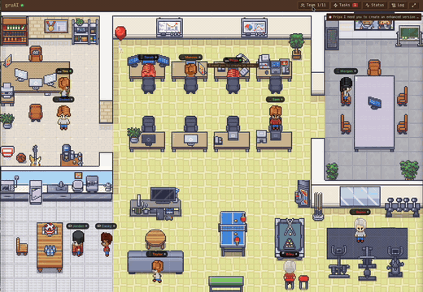

<p align="center">
  <strong>Your AI dev team, visualized.</strong>
</p>

# gruai

[](LICENSE) [](https://www.typescriptlang.org/) []()

<p align="center">
  
</p>

Watch your AI agents work in a pixel-art office. gruai turns Claude Code sessions
into a living simulation -- autonomous agents sitting at desks, writing code,
reviewing PRs, and shipping features while you grab coffee.

No other tool does this. Devin is $500/mo and headless. CrewAI is YAML config files.
gruai gives you a real-time office where you can *see* your team think.

---

## Quickstart

```bash
git clone https://github.com/andrew-yangy/gruai.git
cd gruai && npm install
npm run dev
```

Then in Claude Code, run `/gruai-agents` to scaffold your AI team. The skill
generates agent personalities, a team registry, and a welcome directive so your
team has something to work on immediately. Open [http://localhost:5173](http://localhost:5173)
to see the pixel-art office.

---

## What You Get

### Pixel-Art Office Simulation
Your agents aren't abstract boxes on a kanban board. They're characters in an
office -- walking to their desks, typing at keyboards, gathering around a
whiteboard to brainstorm. The office is a live view of your project's real state.

### Autonomous Agent Teams
Define roles (planner, builder, reviewer, scout) and gruai handles the rest.
Agents pick up directives, decompose them into projects and tasks, build code,
review each other's work, and report back. You approve or redirect -- they execute.

### Directive Pipeline
Every piece of work flows through a structured pipeline: triage, planning, audit,
build, review, completion. Lightweight tasks skip the heavy steps automatically.
No ceremony for small fixes, full rigor for big features.

### Custom Teams
Create your own agent roles with markdown templates in `.claude/agents/`. Give
them personalities, specializations, and memory. The office simulation renders
them as unique characters.

### Live Dashboard
Session kanban, activity tracking, one-click terminal focus, approval actions,
prompt history, and usage insights. Everything you need to manage 10+ concurrent
Claude Code sessions without losing your mind.

---

## Two Ways to Use gruai

### Clone and run (recommended)

```bash
git clone https://github.com/andrew-yangy/gruai.git
cd gruai
npm install
npm run dev
```

Then run `/gruai-agents` in Claude Code to scaffold your team. The dashboard
discovers all Claude Code sessions from `~/.claude/` automatically -- no config needed.

### Install as npm package

```bash
npm install gruai
npm start
```

Then run `/gruai-agents` in Claude Code to scaffold agents into your project.

---

## How It Works

```
Your repo                              gruai
┌─────────────────────┐               ┌──────────────────────────────┐
│ .context/           │               │                              │
│   directives/       │  file watch   │  Directive    Agent          │
│     {id}/           ├──────────────>│  Pipeline  -> Casting        │
│       directive.json│               │                              │
│       projects/     │               │  Session      Pixel-Art     │
│                     │               │  Scanner  --> Office UI      │
│ .claude/            │               │                              │
│   agents/           │  session      │  Process      Live           │
│     {role}.md       │  discovery    │  Discovery -> Dashboard      │
│                     ├──────────────>│                              │
│ ~/.claude/          │               │  WebSocket    React          │
│   projects/         │               │  Server   --> Frontend       │
│     *.jsonl         │               │                              │
└─────────────────────┘               └──────────────────────────────┘
```

1. **Directive Pipeline** reads `.context/directives/` and orchestrates work
   through triage, planning, build, and review phases
2. **Session Scanner** watches `~/.claude/projects/` for live Claude Code sessions
   and extracts metadata (model, branch, current tool, files being edited)
3. **Process Discovery** maps running Claude processes to terminal panes via
   `ps` and `lsof` -- supports tmux, iTerm2, Warp, and Terminal.app
4. **Pixel-Art Office** renders agents as characters in an isometric office,
   with real-time animations tied to actual session state

---

## Terminal Support

Session discovery works on any OS. Terminal focus requires OS integration:

| Environment | Focus | Send Input | Notes |
|-------------|:-----:|:----------:|-------|
| iTerm2 + tmux | Yes | Yes | AppleScript + tmux pane switching |
| iTerm2 native | Yes | Yes | AppleScript with session ID |
| Warp + tmux | Yes | Yes | CGEvents + tmux |
| Warp native | Yes | No | CGEvents tab navigation |
| Terminal.app + tmux | Yes | Yes | Bring to front + tmux |

> Linux and Windows support coming soon.

---

## Optional: Claude Code Hooks

gruai works without hooks. For instant status detection (permission prompts, idle
states), add hooks to `~/.claude/settings.json`:

```json
{
  "hooks": {
    "Notification": [
      {
        "matcher": "permission_prompt",
        "hooks": [{ "type": "command", "command": "bash -c 'INPUT=$(cat); curl -s -X POST http://localhost:4444/api/events -H \"Content-Type: application/json\" -d \"{\\\"type\\\":\\\"permission_prompt\\\",\\\"sessionId\\\":\\\"$(echo $INPUT | jq -r .session_id)\\\",\\\"message\\\":\\\"$(echo $INPUT | jq -r .message)\\\"}\"'" }]
      }
    ],
    "Stop": [
      {
        "hooks": [{ "type": "command", "command": "bash -c 'INPUT=$(cat); curl -s -X POST http://localhost:4444/api/events -H \"Content-Type: application/json\" -d \"{\\\"type\\\":\\\"stop\\\",\\\"sessionId\\\":\\\"$(echo $INPUT | jq -r .session_id)\\\"}\"'" }]
      }
    ]
  }
}
```

Without hooks, status updates via filesystem scanning (slight delay). With hooks,
updates are instant.

---

## Tech Stack

| Layer | Stack |
|-------|-------|
| Server | Node.js + WebSocket + SQLite + chokidar |
| Frontend | React 19 + Vite + Zustand + Tailwind v4 + shadcn/ui |
| Game | Canvas 2D pixel-art engine, 16x16 tile system |
| Terminal | AppleScript (iTerm2) + CGEvents (Warp) + tmux CLI |
| Data | Zero external services -- reads from `~/.claude/` locally |

---

## Scripts

```bash
npm run dev          # Dev mode (server + client with hot reload)
npm run dev:server   # Server only (port 4444)
npm run dev:client   # Vite dev only
npm start            # Production server (serves built assets)
npm run build        # Production build
npm run type-check   # TypeScript check
npm run lint         # ESLint
```

## Claude Code Skills

```
/gruai-agents        # Scaffold AI agent team (replaces gruai init)
/gruai-config        # Update framework files to latest version
/directive           # Run work through the directive pipeline
/report              # CEO dashboard report
/healthcheck         # Internal codebase health check
/scout               # External intelligence gathering
```

---

## License

[MIT](LICENSE)
