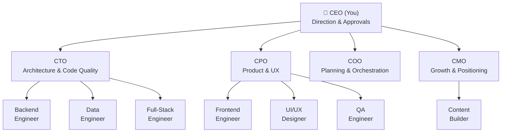

<!-- TODO: CEO — replace with hero GIF showing the pixel-art office with agents walking, typing, and reviewing code in real time. ~10 seconds, 720px wide. -->
<p align="center">
  
</p>

<h1 align="center">gruAI</h1>

<p align="center">
  <strong>An autonomous AI company in your terminal — with a pixel-art office to watch it happen.</strong>
</p>

<p align="center">
  <a href="LICENSE"></a>
  <a href="https://www.typescriptlang.org/"></a>
  <a href="https://www.npmjs.com/package/gru-ai"></a>
  <a href="#"></a>
</p>

---

## What Is gruAI?

Most AI coding tools put you in the driver's seat — prompting, reviewing, re-prompting, clarifying, re-clarifying. You become a full-time AI babysitter.

gruAI flips this. You are the CEO. You hand down a directive ("add dark mode to the dashboard"), and a team of named AI agents handles the rest:

1. Your CTO audits the codebase. C-suite agents **brainstorm approaches, argue trade-offs, and challenge your assumptions** — then clarify with you before anyone writes code.
2. Your COO decomposes the work, assigns builders and reviewers. Engineers build. Reviewers review with fresh context. A mechanical gate blocks shipping until all reviews pass.
3. You get a digest: files changed, tests passed, review summary. Approve or reopen.

The system is designed for **depth, not speed.** Agents accumulate institutional memory across directives — lessons learned, design rationale, standing corrections. Your 10th directive runs better than your 1st because the team remembers what went wrong.

---

## Why Is the Output Better?

Every point below traces to published research from Anthropic and OpenAI. This isn't a workflow we invented — it's assembled from what the research says actually works.

- **Agents brainstorm and argue before anyone writes code.** For strategic directives, your C-suite agents independently propose approaches, then deliberate — challenging assumptions, resolving disagreements, and surfacing questions for you. Anthropic's research found [multi-agent outperformed single-agent by 90.2%](https://www.anthropic.com/engineering/multi-agent-research-system). The pipeline implements their [orchestrator-workers pattern](https://www.anthropic.com/research/building-effective-agents) where specialized agents collaborate, producing better results than any single agent.

- **Reviewers evaluate intent, not just code.** Each reviewer gets [fresh context](https://www.anthropic.com/engineering/effective-context-engineering-for-ai-agents) scoped to the task — they never see the builder's reasoning, preventing confirmation bias. They verify against your Definition of Done (what you asked for), not just whether the code compiles. This is Anthropic's [evaluator-optimizer pattern](https://www.anthropic.com/research/building-effective-agents): one agent generates, another evaluates, issues get fixed in-loop — not after the fact.

- **Context is isolated, not accumulated.** Each agent spawns with a [clean context window](https://www.anthropic.com/engineering/effective-context-engineering-for-ai-agents) scoped to exactly what it needs. No 200K-token sessions where the model forgets what it read at the start. Anthropic's context engineering research shows accuracy degrades as token count increases — gruAI treats context as a finite resource under active degradation.

- **Verification is mechanical.** Bash scripts — not LLMs — enforce pipeline integrity: schema validation, self-review prevention, step dependency checks, role assignment verification. This follows Anthropic's [poka-yoke principle](https://www.anthropic.com/research/building-effective-agents) (error-proof design) and OpenAI's finding that [invariants should be enforced through structural tests](https://openai.com/index/harness-engineering/), not judgment.

- **The harness determines output quality, not model intelligence.** Anthropic found that ["the task verifier must be nearly perfect, otherwise the agent solves the wrong problem"](https://www.anthropic.com/engineering/building-c-compiler). OpenAI's team reached the same conclusion: [3 engineers produced 1M lines of code](https://openai.com/index/harness-engineering/) not by writing better prompts, but by designing better environments and feedback loops. gruAI's 15-step pipeline IS that harness.

- **Memory compounds across directives.** Lessons, design rationale, and standing corrections persist in `.context/` and get loaded into every future agent. This implements the [codified context pattern](https://arxiv.org/abs/2602.20478) — hot-memory + specialized agents + cold-memory knowledge base.

---

## Every Step Has a Reason

Each pipeline step implements a specific recommendation from the research:

| What the Research Says | Source | What gruAI Does |
|------------------------|--------|-----------------|
| Start simple, add complexity only when needed | [Building Effective Agents](https://www.anthropic.com/research/building-effective-agents) | **Triage** classifies by weight — lightweight auto-approves, strategic gets full deliberation |
| Context rot: accuracy degrades as tokens increase | [Context Engineering](https://www.anthropic.com/engineering/effective-context-engineering-for-ai-agents) | Each agent gets **fresh, scoped context** — never a 200K-token accumulated session |
| Multi-agent outperformed single-agent by 90.2% | [Multi-Agent Research](https://www.anthropic.com/engineering/multi-agent-research-system) | C-suite agents **brainstorm independently**, then **deliberate and argue** |
| Give a map, not a 1,000-page manual | [Harness Engineering](https://openai.com/index/harness-engineering/) | CLAUDE.md is a ~100-line pointer file. Detail lives in `.context/` loaded just-in-time |
| Task verifier must be nearly perfect | [Building a C Compiler](https://www.anthropic.com/engineering/building-c-compiler) | **Review gate** mechanically blocks completion without review artifacts |
| One agent generates, another evaluates in a loop | [Building Effective Agents](https://www.anthropic.com/research/building-effective-agents) | Builder → code review → fix → standard review → fix → **review gate** |
| Sub-agents return condensed results with clean context | [Context Engineering](https://www.anthropic.com/engineering/effective-context-engineering-for-ai-agents) | Builders return structured reports. Reviewers never see builder reasoning |
| Persistent state survives session death | [Building a C Compiler](https://www.anthropic.com/engineering/building-c-compiler) | `directive.json` IS the checkpoint — any session reads it and resumes |
| Human review at trust boundaries only | [Building a C Compiler](https://www.anthropic.com/engineering/building-c-compiler) | CEO gates at **approve** and **completion** — not at every step |
| Guardrails enable speed, not impede it | [Harness Engineering](https://openai.com/index/harness-engineering/) | Every skipped step eventually caused a failure — lightweight still runs verification |

---

## The Pipeline

15 steps across 5 phases. The weight system adapts: lightweight tasks skip brainstorming and auto-approve. Strategic tasks get the full process with CEO gates.

**Intake:** Triage → Checkpoint → Read | **Analysis:** Context → Audit → Brainstorm | **Planning:** Clarification → Plan → Approve | **Execution:** Project Brainstorm → Setup → Execute | **Verification:** Review Gate → Wrapup → Completion

Hard gates (require approval): **Approve** (heavyweight/strategic only), **Review Gate** (all weights), **Completion** (all weights).

<details>
<summary><strong>Worked Example: "Rewrite the README"</strong></summary>

This README was built through the pipeline as a **strategic** directive:

| Step | What Happens |
|------|-------------|
| **Triage** | Classified as **strategic** — external research, cross-domain content decisions |
| **Audit** | The CTO identifies 10 messaging gaps and 3 existing assets |
| **Brainstorm** | CTO, CPO, and CMO independently propose approaches, then **argue trade-offs in a deliberation round**. All 3 reject "revolutionary" language. They disagree on line count and resolve at 250-350. They surface 3 questions for the CEO. |
| **Clarification** | CEO answers the 3 questions, adds constraint: "multi-platform is roadmap, not shipped" |
| **Plan** | COO assigns a content builder and a CMO reviewer |
| **Execute** | Builder researches 7 competitors, verifies citation URLs, writes README. Reviewer evaluates with fresh context — no builder reasoning. |
| **Review Gate** | Validation script confirms: no self-review, all 10 DOD criteria verified by reviewer |
| **Completion** | CEO reviews digest: approve, amend, or reopen |

For lighter work (e.g., "fix a typo"), the pipeline skips brainstorming and auto-approves — same verification, less ceremony.

</details>

---

## The Context Tree

All state lives in `.context/` at your repo root — plain markdown and JSON, version-controlled alongside your code.

```
.context/
├── directives/              # All work lives here
│   └── dark-mode/
│       ├── directive.json   # Pipeline state, weight, progress
│       ├── directive.md     # CEO brief
│       ├── audit.md         # CTO's technical audit
│       ├── brainstorm.md    # C-suite deliberation
│       └── projects/
│           └── dark-mode/
│               └── project.json  # Tasks, DOD, agents, reviews
├── lessons/                 # What went wrong (reactive)
├── design/                  # Why the system works this way (proactive)
├── intel/                   # External research from /scout
└── reports/                 # CEO digests
```

**Directive → Projects → Tasks.** A directive is a unit of work ("add dark mode"). The COO decomposes it into projects, each with tasks, agents, reviewers, and a Definition of Done. `directive.json` tracks pipeline progress — any session can read it and resume where it left off. `project.json` is the source of truth for what needs building and whether it passed review.

**Knowledge compounds.** Lessons, design rationale, and standing corrections persist across directives. Agents load relevant context just-in-time — not everything, just what they need for their role and task. No database, no external service — just files.

---

## Your Team

gruAI ships with 11 customizable agents. You are the CEO — everyone reports to you.



C-suite agents have **institutional memory** — lessons and corrections persist across directives. Engineers spawn per-task with fresh context. All agents are markdown files in `.claude/agents/` — add, rename, or customize freely.

---

## gruAI vs Agent Frameworks

| Feature | gruAI | CrewAI | LangGraph | Google ADK | AutoGen | OpenAI SDK | Devin | Manus |
|---------|-------|--------|-----------|------------|---------|------------|-------|-------|
| **License** | MIT | MIT | MIT | Apache 2.0 | MIT | MIT | Proprietary | Proprietary |
| **Cost** | Free | Free / $25+ | Free / $39+ | Free | Free | Free | $20-500+/mo | $39-199/mo |
| **Open Source** | Yes | Yes | Yes | Yes | Yes | Yes | No | No |
| **Built-in Pipeline** | 15-step, weight-adaptive | No | No | No | No | No | Internal (closed) | Internal (closed) |
| **Code Review** | 3-layer + mechanical gate | None | None | None | None | None | Internal | None |
| **Institutional Memory** | Lessons, design docs, corrections | No | No | No | No | No | Limited | No |
| **Agent Personalities** | 11 named agents | Role descriptions | None | None | None | None | Single agent | Single agent |
| **Visual Dashboard** | Session kanban + pixel-art office | None | LangSmith (paid) | None | AutoGen Studio | Traces API | Web IDE | Web IDE |
| **Runs Locally** | Yes | Yes | Yes | Yes | Yes | Yes | No (cloud) | No (cloud) |

---

## The Office

<!-- TODO: CEO — capture screenshot of the full dashboard showing the pixel-art office with HUD panels open. 1200px wide. -->
<p align="center">
  
</p>

The dashboard is an interactive pixel-art office. Click agents to see their sessions. Click furniture (whiteboard, bookshelf, mailbox) to see brainstorms, knowledge base, and notifications. Four HUD tabs — Team, Tasks, Status, Log — show real-time directive progress, DOD tracking, and pipeline state. Every animation is tied to real session state: agents walk to desks when building, gather at the whiteboard when brainstorming, stand up when waiting for approval.

---

## Quickstart

```bash
git clone https://github.com/andrew-yangy/gruai.git
cd gruai && npm install
npm run dev
```

Open [http://localhost:5173](http://localhost:5173). Then scaffold your AI team in Claude Code: `/gruai-agents`

Or: `npm install gru-ai && npx gru-ai`

gruAI currently works with **Claude Code**. Adapters for Codex CLI, Gemini CLI, and Aider are planned — the pipeline and dashboard are engine-agnostic by design.

---

<details>
<summary><strong>Terminal Support</strong></summary>

| Environment | Focus | Send Input | Notes |
|-------------|:-----:|:----------:|-------|
| iTerm2 + tmux | Yes | Yes | AppleScript + tmux pane switching |
| iTerm2 native | Yes | Yes | AppleScript with session ID |
| Warp + tmux | Yes | Yes | CGEvents + tmux |
| Warp native | Yes | No | CGEvents tab navigation |
| Terminal.app + tmux | Yes | Yes | Bring to front + tmux |

Linux and Windows support coming soon.

</details>

<details>
<summary><strong>Claude Code Hooks</strong></summary>

gruAI works without hooks. For instant status detection (permission prompts, idle states), add hooks to `~/.claude/settings.json`:

```json
{
  "hooks": {
    "Notification": [
      {
        "matcher": "permission_prompt",
        "hooks": [
          {
            "type": "command",
            "command": "bash -c 'INPUT=$(cat); curl -s -X POST http://localhost:4444/api/events -H \"Content-Type: application/json\" -d \"{\\\"type\\\":\\\"permission_prompt\\\",\\\"sessionId\\\":\\\"$(echo $INPUT | jq -r .session_id)\\\",\\\"message\\\":\\\"$(echo $INPUT | jq -r .message)\\\"}\"'"
          }
        ]
      }
    ],
    "Stop": [
      {
        "hooks": [
          {
            "type": "command",
            "command": "bash -c 'INPUT=$(cat); curl -s -X POST http://localhost:4444/api/events -H \"Content-Type: application/json\" -d \"{\\\"type\\\":\\\"stop\\\",\\\"sessionId\\\":\\\"$(echo $INPUT | jq -r .session_id)\\\"}\"'"
          }
        ]
      }
    ]
  }
}
```

</details>

<details>
<summary><strong>Scripts</strong></summary>

```bash
npm run dev          # Dev mode (server + client with hot reload)
npm run dev:server   # Server only (port 4444)
npm run dev:client   # Vite dev only
npm start            # Production server (serves built assets)
npm run build        # Production build
npm run type-check   # TypeScript check
npm run lint         # ESLint
```

</details>

<details>
<summary><strong>Claude Code Skills</strong></summary>

```
/gruai-agents        # Scaffold AI agent team with personalities and roles
/gruai-config        # Update framework files to latest version
/directive           # Run work through the directive pipeline
/report              # CEO dashboard report
/healthcheck         # Internal codebase health check
/scout               # External intelligence gathering
```

</details>

<details>
<summary><strong>Tech Stack</strong></summary>

| Layer | Stack |
|-------|-------|
| Server | Node.js + WebSocket + SQLite + chokidar |
| Frontend | React 19 + Vite + Zustand + Tailwind v4 + shadcn/ui |
| Game | Canvas 2D pixel-art engine, 16x16 tile system |
| Terminal | AppleScript (iTerm2) + CGEvents (Warp) + tmux CLI |
| Data | Zero external services -- reads from `~/.claude/` locally |

</details>

<details>
<summary><strong>Research References</strong></summary>

- [Building Effective Agents](https://www.anthropic.com/research/building-effective-agents) (Anthropic, Dec 2024) — evaluator-optimizer, orchestrator-workers, poka-yoke
- [Effective Context Engineering](https://www.anthropic.com/engineering/effective-context-engineering-for-ai-agents) (Anthropic, Sep 2025) — context rot, progressive disclosure, sub-agent isolation
- [Multi-Agent Research System](https://www.anthropic.com/engineering/multi-agent-research-system) (Anthropic, Jun 2025) — 90.2% multi-agent improvement, token usage = 80% of variance
- [Building a C Compiler](https://www.anthropic.com/engineering/building-c-compiler) (Anthropic, Feb 2026) — harness quality > model intelligence
- [Harness Engineering](https://openai.com/index/harness-engineering/) (OpenAI, Feb 2026) — 3 engineers + Codex = 1M lines, structural invariants
- [Codified Context](https://arxiv.org/abs/2602.20478) (ArXiv, Feb 2026) — hot-memory + specialized agents + cold-memory knowledge base

</details>

---

[MIT](LICENSE)
