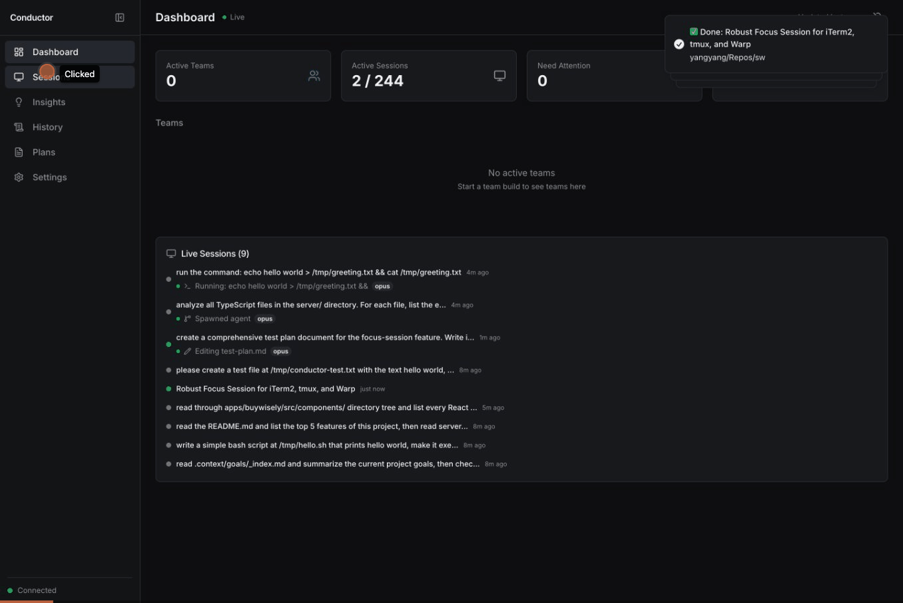

# Agent Conductor

A real-time dashboard for monitoring [Claude Code](https://docs.anthropic.com/en/docs/claude-code) sessions. See all your sessions across every project, track agent teams, approve prompts from the browser, and clean up stale resources.

   



## Why

Claude Code stores session logs, team configs, and task lists under `~/.claude/` — but there's no built-in way to see what's happening across all your sessions. If you're running multiple projects, using agent teams, or just want to know which sessions are still active, you're left checking individual terminal tabs.

Agent Conductor reads directly from `~/.claude/` and gives you a single dashboard with:

- Every session across all projects, organized in a tree
- Real-time activity (which tool is running, what file is being edited)
- Agent team status and task progress
- The ability to send input and approve prompts without switching windows

## Features

- **Automatic session discovery** — scans `~/.claude/projects/` JSONL files on disk. No hooks or configuration required.
- **Live activity** — see what each session is doing in real-time (editing files, running commands, thinking)
- **Project tree view** — sessions grouped by project, subagents nested under their parent, with time and status filters
- **Team monitoring** — track team members, task progress, and agent status
- **Send input** — approve/reject prompts and send text to agents directly from the dashboard
- **Stale team cleanup** — delete old teams and task lists with one click
- **macOS notifications** — native alerts when agents need attention (even when the browser is minimized)

## Quick Start

```bash
git clone https://github.com/andrew-yangy/agent-conductor.git
cd agent-conductor
npm install
npm run dev
```

Open [http://localhost:5173](http://localhost:5173). The server runs on port 4444.

That's it. Agent Conductor automatically discovers your Claude Code sessions from `~/.claude/`.

## Architecture

```
~/.claude/                          Agent Conductor
┌─────────────────────┐            ┌──────────────────────────────────────┐
│ projects/           │            │                                      │
│   {project}/        │  chokidar  │  ┌──────────────┐   ┌────────────┐  │
│     {uuid}.jsonl  ──┼──watch────>│  │   Session     │──>│            │  │
│     {uuid}/         │            │  │   Scanner     │   │ Aggregator │  │
│       subagents/    │            │  └──────────────┘   │            │  │
│         agent-*.jsonl            │                      │  merges    │  │
│                     │            │  ┌──────────────┐   │  sources   │  │
│ teams/              │  read      │  │   Team &     │──>│  into      │  │
│   {team}/config.json├──────────>│  │   Task       │   │  state     │  │
│                     │            │  │   Parsers    │   │            │  │
│ tasks/              │  read      │  └──────────────┘   └─────┬──────┘  │
│   {team}/*.json   ──┼──────────>│                            │         │
└─────────────────────┘            │                       WebSocket     │
                                   │                            │         │
  ┌─────────────┐                  │                     ┌──────▼──────┐  │
  │ Hook events │   POST           │                     │   React     │  │
  │ (optional)  ├──/api/events───>│  enrich status ────>│   Dashboard │  │
  └─────────────┘                  │                     └─────────────┘  │
                                   └──────────────────────────────────────┘
```

**How data flows:**

1. **Session Scanner** watches `~/.claude/projects/` for JSONL files. For active sessions (modified < 30s ago), it tail-reads the last 8KB to extract metadata (model, git branch, cwd, tools in use). Inactive sessions use file path info only — safe for directories with hundreds of sessions.

2. **Team & Task Parsers** read team configs from `~/.claude/teams/` and task lists from `~/.claude/tasks/`. Subagent relationships are built from the file structure (`{uuid}/subagents/agent-{id}.jsonl`).

3. **Aggregator** merges all sources into a single state object. Filesystem scanning is the primary source; hook events optionally enrich session status (waiting for approval, errors) within a 5-minute window.

4. **WebSocket** pushes state updates to the React dashboard in real-time. File watchers use debounced timers (500ms for activity, 1s for session refresh) to avoid overwhelming the client.

## Configuration

Config lives at `~/.conductor/config.json` (auto-created on first run):

```json
{
  "claudeHome": "~/.claude",
  "server": { "port": 4444 },
  "notifications": {
    "macOS": true,
    "browser": true
  }
}
```

### Optional: Claude Code hooks

For richer status detection (waiting for approval, errors), add hooks to `~/.claude/settings.json`:

```json
{
  "hooks": {
    "stop": ["bash", "-c", "curl -s -X POST http://localhost:4444/api/events -H 'Content-Type: application/json' -d '{\"type\":\"stop\",\"sessionId\":\"'$SESSION_ID'\",\"project\":\"'$PROJECT'\"}'"],
    "notification": ["bash", "-c", "curl -s -X POST http://localhost:4444/api/events -H 'Content-Type: application/json' -d '{\"type\":\"'$TYPE'\",\"sessionId\":\"'$SESSION_ID'\",\"project\":\"'$PROJECT'\",\"message\":\"'$MESSAGE'\"}'"]
  }
}
```

Hooks are optional — session discovery works without them via filesystem scanning.

## Supported Environments

### Session Discovery (works everywhere)
Session scanning reads `~/.claude/projects/` JSONL files — this works on any OS where Claude Code runs.

### Focus Session (click to navigate)
Clicking a session card to jump to its terminal pane requires **tmux** for process discovery, plus a supported terminal for window/tab activation:

| Environment | Status | Notes |
|-------------|--------|-------|
| **macOS + iTerm2 + tmux** | Supported | Full support — switches to correct iTerm2 tab and tmux pane |
| **macOS + Terminal.app + tmux** | Partial | Brings Terminal.app to front, switches tmux pane, but no tab switching |
| **macOS + Warp + tmux** | Partial | Brings Warp to front, switches tmux pane, but no tab switching |
| **Linux + any terminal + tmux** | Not yet | Needs `xdotool`/`wmctrl` for window focus |
| **Any OS without tmux** | Not supported | Process discovery relies on tmux pane→PID mapping |

### TODO: Environment Support
- [ ] **Linux window focus**: Replace `osascript`/`NSRunningApplication` with `xdotool` or `wmctrl`
- [ ] **Terminal.app tab switching**: Add Terminal.app-specific AppleScript for tab selection
- [ ] **Warp tab switching**: Warp doesn't expose AppleScript tab control yet — monitor for API updates
- [ ] **Kitty/Alacritty support**: Add `kitty @ focus-window` and Alacritty msg IPC for focus
- [ ] **Non-tmux discovery**: Alternative process→terminal mapping without tmux (e.g., via `/proc` on Linux, `lsof` on macOS)
- [ ] **Windows support**: PowerShell-based window activation + Windows Terminal tab switching

## Tech Stack

- **Server**: Node.js with raw `http.createServer` + `ws` WebSocket + SQLite (better-sqlite3) + chokidar file watching
- **Frontend**: React 19 + Vite + Zustand + Tailwind v4 + shadcn/ui + Radix primitives
- **Zero external services** — everything runs locally, reads from `~/.claude/`

## Scripts

```bash
npm run dev          # Start server + client (concurrent)
npm run dev:server   # Server only (port 4444)
npm run dev:client   # Vite dev server only
npm run build        # Production build
npm run type-check   # TypeScript check
npm run lint         # ESLint
```

## API

| Method | Endpoint | Description |
|--------|----------|-------------|
| GET | `/api/state` | Full dashboard state |
| GET | `/api/events` | Recent events |
| POST | `/api/events` | Add hook event |
| POST | `/api/actions/focus-session` | Focus tmux pane |
| POST | `/api/actions/send-input` | Send input to agent |
| DELETE | `/api/teams/:name` | Delete stale team |
| GET | `/api/config` | Get config |
| PATCH | `/api/config` | Update config |
| WS | `ws://localhost:4444` | Real-time updates |

## License

MIT
